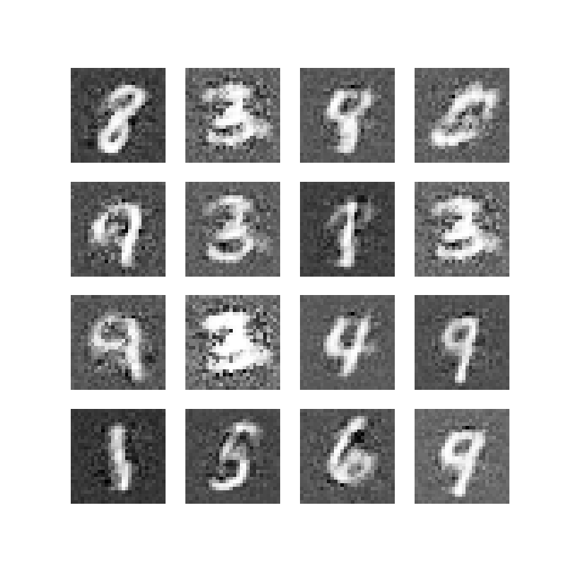

# Vanilla GAN

A PyTorch implementation of the original Generative Adversarial Network (GAN) introduced by [Goodfellow et al. (2014)](https://arxiv.org/abs/1406.2661), trained on the MNIST dataset to generate handwritten digits.

## Results

Generated samples after training with `latent_dim=256`:


## Architecture

**Generator**
- Input: Random noise vector (256-dim)
- 4 fully connected layers (256 → 256 → 512 → 1024 → 784)
- BatchNorm + LeakyReLU (0.2) after each hidden layer
- Tanh output activation

**Discriminator**
- Input: Flattened image (784-dim)
- 3 fully connected layers (784 → 512 → 256 → 1)
- LeakyReLU (0.2) + Dropout (0.3) after hidden layers
- Sigmoid output activation

## Training Details

| Hyperparameter | Value |
|---|---|
| Latent Dimension | 256 |
| Batch Size | 64 |
| Epochs | 50 |
| Optimizer | Adam |
| LR Generator | 0.0002 |
| LR Discriminator | 0.0001 |
| Betas | (0.5, 0.999) |
| Loss | BCELoss |
| Label Smoothing | 0.9 (real labels) |

## Setup

```bash
git clone https://github.com/yourusername/vanilla-gan.git
cd vanilla-gan
pip install torch torchvision numpy
```

## Usage

**Training** (Kaggle Notebook):
```bash
python train.py
```

**Inference** (local, CPU):
```python
import torch
from model.Generator import Generator

generator = Generator(latent_dim=256)
generator.load_state_dict(torch.load('generator.pth', map_location=torch.device('cpu')))
generator.eval()

z = torch.randn(1, 256)
generated_image = generator(z).view(28, 28).detach().numpy()
```

## Project Structure

```
vanilla-gan/
├── model/
│   ├── Generator.py
│   └── Discriminator.py
├── utils/
│   └── MNISTLoader.py
├── outputs/
│   └── inference/
│       └── model1-latent-dim-256/
├── train.py
├── eval.py
└── README.md
```

## References

- Goodfellow, I. et al. — [Generative Adversarial Nets](https://arxiv.org/abs/1406.2661) (NeurIPS 2014)